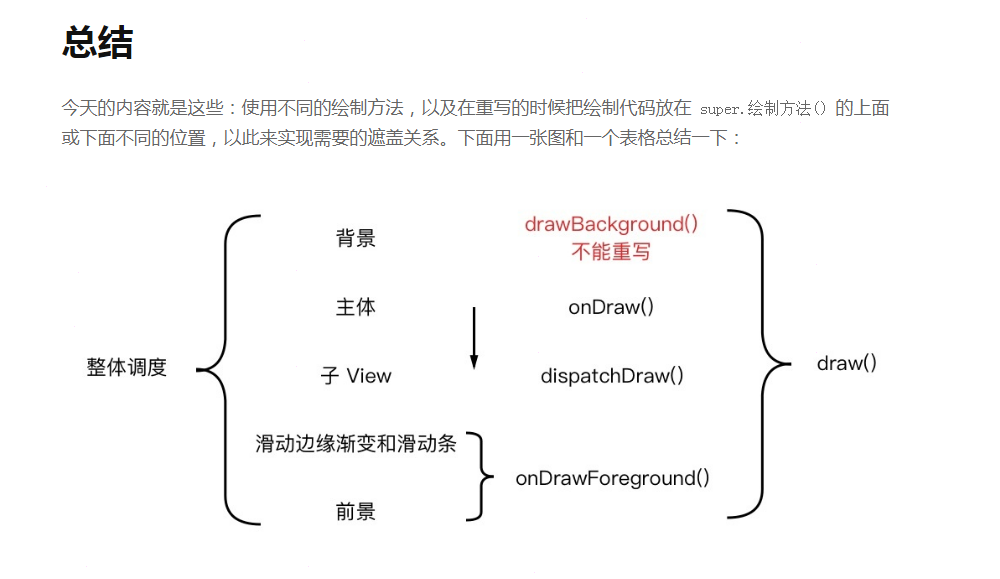
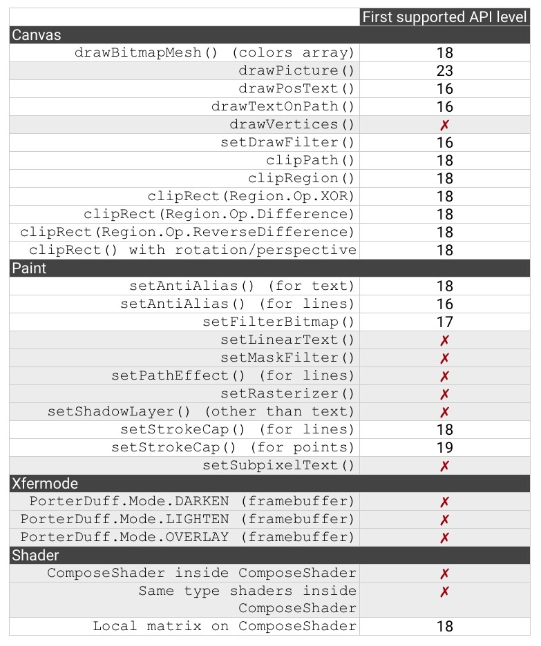

[kotlin笔记](https://github.com/RottenWang/ViewViewView/blob/master/kotlin%E5%AD%A6%E4%B9%A0%E7%AC%94%E8%AE%B0.md)

#自定义控件
http://www.gcssloop.com/customview/Canvas_Convert

#
https://github.com/codeestX/GeekNews

#工具类
https://github.com/cuiyue1988/CommonUtilLibrary

#工具类
https://github.com/cuiyue1988/AndroidUtilCode

#状态栏
http://blog.csdn.net/guolin_blog/article/details/51763825

#lottie
http://www.jianshu.com/p/cae606f45c0b

#锁屏弹activity
http://blog.163.com/shexinyang@126/blog/static/136739312201502351946523/

#notification
http://www.jianshu.com/p/22e27a639787

#git
https://git-scm.com/doc

#git 看到了哪
https://git-scm.com/book/en/v2/Git-Branching-Remote-Branches

#kotlin
https://www.kotlincn.net/

#kotlin vs Java
http://www.jcodecraeer.com/demo/from-java-to-kotlin/index.html

#鸿扬自定义view
http://www.imooc.com/learn/239

#AS2.3 run bug
http://blog.csdn.net/lucasey/article/details/61071377

#RecyclerView 悬浮效果
http://www.jianshu.com/p/b335b620af39

#RecyclerView LayoutManager
http://blog.coderclock.com/2017/03/26/android/%E5%85%B3%E4%BA%8EAndroid%20RecyclerView%E7%9A%84%E9%82%A3%E4%BA%9B%E5%BC%80%E6%BA%90LayoutManager/

#状态栏
http://www.jianshu.com/p/932568ed31af

#5.x
http://blog.csdn.net/ss1168805219/article/details/53189366

#SurfaceView  绘制
http://www.cnblogs.com/xuling/archive/2011/06/06/android.html

#启动页闪屏
http://blog.csdn.net/zivensonice/article/details/51691136

#Github Release 实现自动更新功能
http://blog.csdn.net/Eggy2015/article/details/52138751

#OpenGL
http://www.jianshu.com/nb/2135411

#GPUImage
http://www.jianshu.com/p/7a58a7a61f4c

#WebView解析
http://blog.csdn.net/carson_ho/article/details/52693322

#Rxjava
https://gank.io/post/560e15be2dca930e00da1083#toc_1

http://www.jianshu.com/p/fbfdd6fa6154

#blueTooth
http://blog.csdn.net/vnanyesheshou/article/details/51554852

#Transition
http://rkhcy.github.io/2017/09/27/TransitionNote2/

#各种手机日志抓取
http://bbs.360.cn/thread-14766776-1-1.html

#插值器
http://inloop.github.io/interpolator/

#View绘制相关方法及先后顺序

#支持硬件加速(GPU代替CPU绘制)最低级别API

